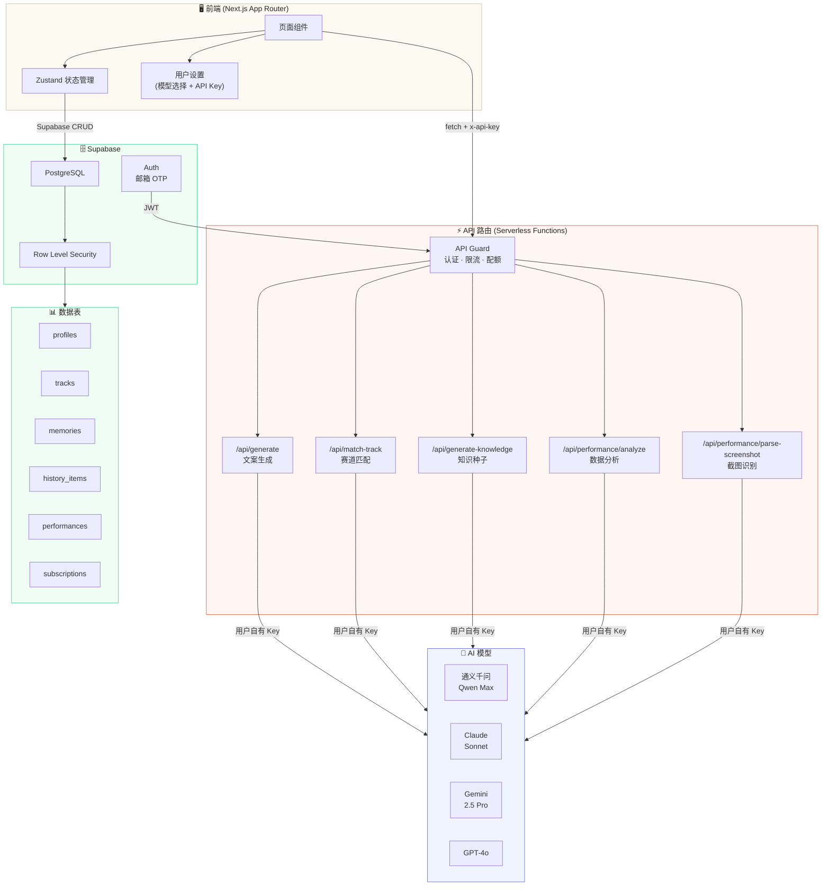
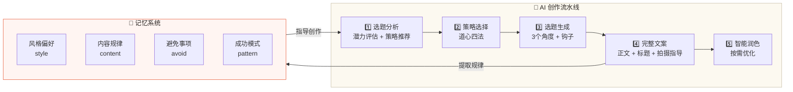

<div align="center">

# 道心文案

**AI 驱动的短视频文案创作平台**

基于「道心四法」策略体系，为短视频创作者提供从选题分析到完整文案的一站式 AI 创作工具。

[](https://nextjs.org/)
[](https://www.typescriptlang.org/)
[](https://supabase.com/)
[](https://vercel.com/)

</div>

---

## 功能特性

**AI 创作流水线**
- 选题分析 → 策略推荐 → 多角度选题 → 完整文案 → 智能润色
- 道心四法策略：明道·洞见 / 动心·共鸣 / 启思·价值 / 破局·创意
- 自动生成情绪曲线、拍摄指导、BGM 推荐

**赛道管理**
- 自定义赛道（主题方向），每条赛道独立记忆体系
- AI 自动匹配内置知识库或生成专属知识种子
- 赛道画像配置：目标受众、人设、变现方向、内容目标

**记忆系统**
- 四类记忆：风格偏好 / 内容规律 / 避免事项 / 成功模式
- AI 每次创作自动提取并沉淀规律
- 置信度衰减 + 数据反馈强化机制

**数据表现追踪**
- 截图识别自动提取播放、点赞、收藏等数据
- AI 分析内容表现，优化创作策略
- 数据驱动记忆校准

**多模型支持**
- 通义千问 Qwen Max / Claude Sonnet / Gemini 2.5 Pro / GPT-4o
- 用户自配 API Key，按需选择模型

---

## 系统架构





---

## 技术栈

| 层级 | 技术 |
|------|------|
| 框架 | Next.js 16 (App Router) |
| 语言 | TypeScript |
| 状态管理 | Zustand v5 |
| 数据库 | Supabase (PostgreSQL + RLS) |
| 认证 | Supabase Auth (邮箱 OTP) |
| AI SDK | Vercel AI SDK |
| 部署 | Vercel (Serverless) |
| 样式 | CSS Variables + Tailwind |

---

## 快速开始

### 1. 克隆并安装

```bash
git clone https://github.com/CJBshuosi/daoxin.git
cd daoxin
npm install
```

### 2. 配置环境变量

```bash
cp .env.example .env.local
```

在 `.env.local` 中填写：

```env
NEXT_PUBLIC_SUPABASE_URL=你的Supabase项目URL
NEXT_PUBLIC_SUPABASE_ANON_KEY=你的Supabase Anon Key
```

### 3. 初始化数据库

在 Supabase Dashboard → SQL Editor 中执行：

```
supabase/migrations/001_initial_schema.sql
```

### 4. 启动开发服务器

```bash
npm run dev
```

访问 `http://localhost:3000`

---

## 项目结构

```
src/
├── app/
│   ├── api/                  # API 路由 (Serverless Functions)
│   │   ├── generate/         # AI 文案生成
│   │   ├── match-track/      # 赛道匹配
│   │   ├── generate-knowledge/ # 知识种子生成
│   │   ├── performance/      # 数据分析 + 截图识别
│   │   └── search/           # 联网搜索
│   ├── login/                # 邮箱 OTP 登录
│   └── page.tsx              # 主页面
├── components/
│   ├── generation/           # 创作流水线 UI
│   ├── track/                # 赛道管理
│   ├── knowledge/            # 知识库
│   ├── performance/          # 数据表现
│   ├── memory/               # 记忆管理
│   ├── settings/             # 设置（模型 + API Key）
│   └── layout/               # 布局组件
├── store/                    # Zustand 状态管理
├── lib/                      # 工具库（Prompt、模型、Supabase）
└── types/                    # TypeScript 类型定义
```

---

## 部署

```bash
npm i -g vercel
vercel --prod
```

在 Vercel 项目 Settings → Environment Variables 中添加 Supabase 环境变量。

---

## License

MIT
