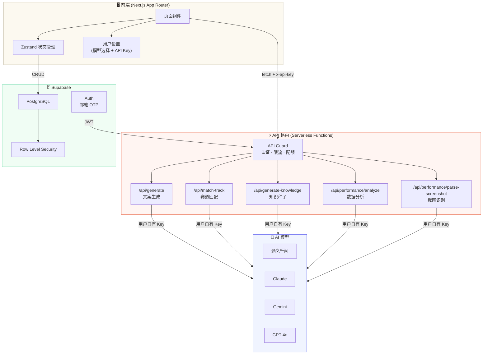
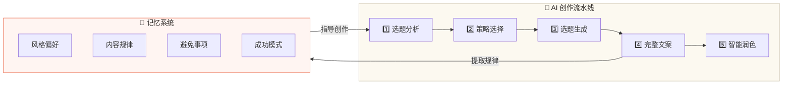

<p align="center"><strong>中文 | <a href="README.md">English</a></strong></p>

<h1 align="center"> 道心文案 </h1>

<p align="center"> ⚡ AI 驱动的短视频文案创作与内容策略平台 ⚡ </p>

<p align="center">
  
  
  
  
</p>

---

## 📖 目录

- [项目概述](#-项目概述)
- [核心功能](#-核心功能)
- [技术栈与架构](#-技术栈与架构)
- [项目结构](#-项目结构)
- [产品截图](#-产品截图)
- [快速开始](#-快速开始)
- [使用指南](#-使用指南)
- [参与贡献](#-参与贡献)
- [开源协议](#-开源协议)

---

## 🌟 项目概述

**道心文案** 是一个高性能的 AI 内容生成与策略平台，专为短视频创作者打造。通过多步骤生成工作流和深度行业知识库，帮助用户从一个想法快速产出专业、高质量的文案。

### 痛点
> 短视频时代，文案是内容的灵魂。然而大多数创作者面临的困境是：写文案靠灵感，灵感靠运气。手动研究行业赛道、反复打磨文案消耗大量时间，导致产出不稳定、数据波动大。

### 解决方案
道心文案不只是一个「文案生成器」——它会分析特定赛道的上下文，运用经过验证的内容策略（道心四法），引导用户通过精细化的 5 步流程完成创作。每次创作后，AI 会自动提取创作规律沉淀为「记忆」，结合数据表现反馈不断校准——**用得越多，越懂你的风格和受众**。

### 道心四法

| 策略 | 核心驱动 | 擅长目标 |
|------|---------|---------|
| **明道·洞见** | 认知落差 | 完播率、收藏 |
| **动心·共鸣** | 情感共振 | 点赞、评论 |
| **启思·价值** | 实用价值 | 收藏、关注 |
| **破局·创意** | 新奇视角 | 转发、出圈 |

### 谁适合用？
- 短视频博主 / MCN 运营 — 批量生产高质量文案
- 知识付费创作者 — 快速产出选题和脚本
- 品牌方 / 电商卖家 — 带货视频文案创作

---

## ✨ 核心功能

### 🚀 五步引导式创作
消除「空白页焦虑」的结构化创作流程：
- **第一步：选题确认** — 验证核心创意，分析选题潜力
- **第二步：策略选择** — 选择道心四法中最适合的策略
- **第三步：选题生成** — AI 生成 3 个不同角度的选题方案
- **第四步：完整文案** — 生成正文 + 爆款标题 + 拍摄指导 + BGM 推荐
- **第五步：智能润色** — 按需微调，打磨到满意为止

### 📚 深度赛道知识库
平台内置丰富的行业赛道知识，让 AI 真正理解细分领域的内容规律：
- **专业赛道**：理财、商业、职场
- **生活赛道**：美食、旅行、育儿
- **垂直赛道**：数码、健身、心理
- **文化赛道**：国学、修心、易经、佛学

### 📊 数据表现分析
不只是创作，还要持续优化：
- **截图识别**：上传数据截图，AI 自动提取播放、点赞、收藏等指标
- **情绪曲线**：可视化文案的叙事节奏和情绪走向
- **AI 分析报告**：基于真实数据给出策略优化建议

### 🧠 智能记忆系统
平台会「记住」你的创作偏好和成功经验：
- **四类记忆**：风格偏好 / 内容规律 / 避免事项 / 成功模式
- **自动沉淀**：每次创作自动提取规律
- **置信度机制**：数据好的记忆强化，数据差的自动衰减
- **跨赛道迁移**：将成功策略自动应用到其他赛道

### 🔒 安全与同步
- **Supabase 集成**：安全的用户认证 + 云端数据同步
- **行级安全**：每个用户只能访问自己的数据
- **API Key 本地存储**：用户自有密钥，不经服务器存储

### 🤖 多模型支持
- 通义千问 Qwen Max — 中文创意最强，性价比高
- Claude Sonnet — 结构化输出最稳定
- Gemini 2.5 Pro — 多模态能力强
- GPT-4o — 综合能力出色

---

## 🛠️ 技术栈与架构

| 技术 | 用途 | 选型理由 |
| :--- | :--- | :--- |
| **Next.js 16** | 全栈框架 | Server Components + App Router，部署即 Serverless |
| **React 19** | 前端框架 | 最新并发渲染，流畅的用户体验 |
| **TypeScript** | 类型安全 | 保障复杂 AI 流程的代码可维护性 |
| **Tailwind CSS** | 样式方案 | 工具类优先，快速开发 |
| **Supabase** | 后端 / 认证 | PostgreSQL + Auth + RLS，开箱即用 |
| **Vercel AI SDK** | AI 集成 | 统一接口对接多家大模型 |
| **Zustand** | 状态管理 | 轻量、高性能、比 Redux 简洁 |
| **Lucide React** | 图标库 | 统一美观的 SVG 图标 |

### 系统架构





---

## 📁 项目结构

```
道心文案/
├── 📁 src/                         # 核心源代码
│   ├── 📁 app/                     # Next.js App Router（页面 + API）
│   │   ├── 📁 api/                 # 后端 API 路由
│   │   │   ├── 📁 generate/        # AI 文案生成
│   │   │   ├── 📁 match-track/     # 赛道匹配
│   │   │   ├── 📁 generate-knowledge/ # 知识种子生成
│   │   │   ├── 📁 performance/     # 数据分析 + 截图识别
│   │   │   └── 📁 search/          # 联网搜索
│   │   ├── 📁 auth/                # 认证回调
│   │   ├── 📁 login/               # 邮箱 OTP 登录页
│   │   ├── 📄 layout.tsx           # 全局布局
│   │   └── 📄 page.tsx             # 主页面入口
│   ├── 📁 components/              # UI 组件
│   │   ├── 📁 generation/          # 五步创作流水线
│   │   ├── 📁 knowledge/           # 知识库管理
│   │   ├── 📁 performance/         # 数据表现分析
│   │   ├── 📁 track/               # 赛道管理
│   │   ├── 📁 memory/              # 记忆管理
│   │   ├── 📁 settings/            # 设置（模型 + API Key）
│   │   ├── 📁 ui/                  # 基础 UI 组件
│   │   └── 📁 layout/              # 布局组件
│   ├── 📁 hooks/                   # 自定义 Hooks
│   ├── 📁 lib/                     # 核心工具库
│   │   ├── 📄 api-guard.ts         # API 认证 + 限流 + 配额
│   │   ├── 📄 model.ts             # AI 模型配置
│   │   └── 📄 prompt.ts            # Prompt 工程
│   ├── 📁 store/                   # Zustand 状态管理
│   └── 📁 types/                   # TypeScript 类型定义
├── 📁 supabase/migrations/         # 数据库迁移文件
├── 📁 doc/knowledge/               # 赛道知识库（Markdown）
├── 📄 middleware.ts                # 路由保护 + Session 刷新
└── 📄 package.json
```

---

## 📸 产品截图


<em><p align="center">工作台 — AI 驱动的内容创作主界面</p></em>


<em><p align="center">五步引导式创作流水线</p></em>


<em><p align="center">数据表现分析与情绪曲线可视化</p></em>

---

## 🚀 快速开始

### 前置要求

- **Node.js** v20 或更高版本
- **npm** v10 或更高版本
- **Git**

### 安装步骤

1. **克隆仓库**
   ```bash
   git clone https://github.com/CJBshuosi/daoxin.git
   cd daoxin
   ```

2. **安装依赖**
   ```bash
   npm install
   ```

3. **配置环境变量**
   ```bash
   cp .env.example .env.local
   ```
   在 `.env.local` 中填写 Supabase 项目 URL 和 Anon Key。

4. **初始化数据库**

   在 Supabase Dashboard → SQL Editor 中执行 `supabase/migrations/001_initial_schema.sql`。

5. **启动开发服务器**
   ```bash
   npm run dev
   ```
   打开 [http://localhost:3000](http://localhost:3000)

6. **生产构建**
   ```bash
   npm run build
   npm run start
   ```

---

## 🔧 使用指南

### 创作文案
1. **选择赛道** — 在赛道管理中创建或选择你的内容方向
2. **开始创作** — 在工作台输入主题，启动五步创作流程
3. **确认选题** — AI 分析选题潜力，推荐最佳策略
4. **选择策略** — 从道心四法中选择匹配的内容策略
5. **生成文案** — AI 产出完整文案 + 标题 + 拍摄指导
6. **润色优化** — 按需调整，直到满意

### 数据分析
- **上传截图** — 在数据表现页上传视频数据截图，AI 自动识别指标
- **查看分析** — 系统基于真实数据分析表现，给出策略优化建议

### 设置模型
- 进入设置页，选择 AI 模型并填写对应的 API Key
- API Key 仅保存在浏览器本地，不会上传到服务器

---

## 🤝 参与贡献

欢迎贡献代码！你的参与让道心文案变得更好。

### 贡献流程

1. **Fork 仓库**
2. **创建功能分支**
   ```bash
   git checkout -b feature/amazing-feature
   ```
3. **开发并测试**
   ```bash
   npm run lint
   ```
4. **提交代码**
   ```bash
   git commit -m 'feat: 新增xxx功能'
   ```
5. **推送并提交 PR**
   ```bash
   git push origin feature/amazing-feature
   ```

### 开发规范
- ✅ 遵循现有代码风格（ESLint 已配置）
- 📝 复杂的 AI Prompt 逻辑请加注释
- 🧪 确保新组件具备响应式和可访问性
- 📚 修改赛道知识时同步更新 `/doc/knowledge/`

有问题？欢迎提 Issue 讨论。

---

## 📝 开源协议

本项目采用 **MIT 协议** — 详见 [LICENSE](LICENSE) 文件。

- ✅ **商业使用**：可用于商业项目
- ✅ **修改**：可自由修改代码
- ✅ **分发**：可自由分发
- ✅ **私有使用**：可私有部署
- ⚠️ **免责**：软件按「原样」提供，不含任何保证

---

<p align="center">Made with ❤️ by 道心文案团队</p>
<p align="center">
  <a href="#">⬆️ 回到顶部</a>
</p>
